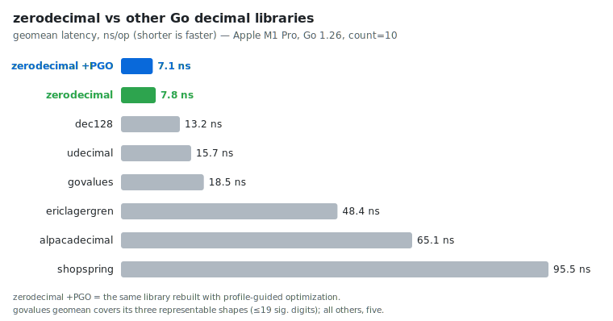

# zerodecimal

Zero-allocation, panic-free, fixed-point decimals for latency-critical Go.

## Why another decimal library

- **Strictly zero heap allocations.** Parsing, arithmetic, comparison,
  rounding, conversions, and every Unmarshal/Scan path perform exactly zero
  heap allocations — success and error paths alike — enforced by
  `testing.AllocsPerRun` gates in the default test suite
  ([alloc_test.go](alloc_test.go)).
- **Faster than every Go decimal library we could find.** The committed
  benchstat comparisons show a −41% time geomean against jokruger/dec128 and
  −50% against quagmt/udecimal — the two nearest rivals — and −92% against
  shopspring/decimal ([benchmarks/bench-vs-\*.txt](benchmarks/)).
- **Bit-exact.** Every operation is differentially checked against
  shopspring/decimal's unbounded arithmetic — including an *iff* proof for
  every returned overflow — deterministically in the default suite
  ([crosscheck_test.go](crosscheck_test.go)) and by 26 fuzz targets
  ([fuzz_test.go](fuzz_test.go)).
- **Panic-free.** Fallible operations return zero-allocation sentinel errors
  ([errors.go](errors.go)) and the fuzz suite requires every target to be
  total — no input, including garbage binary payloads, may panic the library.

## Install

```sh
go get github.com/AlexandrosKyriakakis/zerodecimal
```

```go
import "github.com/AlexandrosKyriakakis/zerodecimal" // package zerodecimal
```

Requires Go 1.26+. The library has zero runtime dependencies.

```go
price, err := zerodecimal.NewFromString("99.99")
if err != nil {
    return err
}
qty := zerodecimal.NewFromInt(3)

total, err := price.Mul(qty)
if err != nil {
    return err
}
fmt.Println(total)                // 299.97
fmt.Println(total.StringFixed(4)) // 299.9700
```

Runnable examples for parsing, arithmetic, rounding, JSON, and SQL live in
[example_test.go](example_test.go).

## Design

```go
type Decimal struct {
    coef u128  // |value| · 10^prec, 0 ≤ coef < 2^128
    neg  bool
    prec uint8 // fractional digits, 0..19
}
```

A Decimal is a 24-byte pointer-free value: copy it freely, compare it cheaply,
pack it densely. The domain is |value| < 2^128 / 10^prec — up to 39
significant digits with up to 19 fractional. There is **no `big.Int` anywhere
in the package**: every operation runs on fixed-width 128/256-bit integer
math, so nothing can escape to the heap and magnitude overflow returns
`ErrOverflow` instead of degrading into arbitrary-precision slowness; a result
needing more than `DefaultPrec` fractional digits is instead truncated toward
zero by `Mul` and `Div` (possibly to exact zero, as with a tiny nonzero
product). The zero value is the canonical decimal zero, ready to use; no
operation produces a negative zero.

**Reciprocal division is the headline optimization.** Decimal rescaling,
rounding, formatting, and division all reduce to dividing by powers of ten,
and zerodecimal never asks the hardware divider to do it: 64-bit dividends
use precomputed Granlund–Montgomery–Warren multiply-high magics, and
128/256-bit dividends chain Möller–Granlund 2-by-1 steps off a precomputed
reciprocal table ([div10.go](div10.go), tables generated and re-proven
against `bits.Div64` and `big.Int` in [tables_test.go](tables_test.go)).
A multiply-high plus a shift replaces an 18-cycle `DIV` — and for 128-bit
dividends, two *dependent* `DIV`s — which is where most of the headroom over
udecimal comes from.

`Div` uses **adaptive precision**: the result is the exact quotient truncated
at the largest precision ≤ `DefaultPrec` (19 by default) whose coefficient
still fits 128 bits, so huge quotients degrade precision gracefully and
`ErrOverflow` is reserved for integer quotients that genuinely exceed 2^128.

Because `==` compares representations, an arithmetic result of `1.50` differs
from a parsed `1.5` under `==`; use `Equal` or `Cmp` for numeric comparison.
Parsing trims trailing fractional zeros; arithmetic never does (it would tax
the hot path); formatting trims at output. `Trim` canonicalizes a value on
demand — equal numbers become identical under `==` and as map keys — and
`Rescale` sets an exact representation precision (e.g. `1.50` for a
two-decimal wire format), rounding ties to even when lowering.

## Error model

All sentinels live in [errors.go](errors.go), are returned bare (never
wrapped, except `Scan`'s precomputed `bool` and `time.Time` unsupported-type
errors, which wrap `ErrScanType`), and match with `errors.Is`. The constructors and arithmetic operations have panicking twins
for call sites with proven bounds; rows marked `—` below have none.

| Operation | Possible sentinels | Panicking twin |
| --- | --- | --- |
| `New` | `ErrOverflow`, `ErrPrecOutOfRange` | `MustNew` |
| `NewFromString`, `ParseBytes` | `ErrEmptyString`, `ErrMaxStrLen`, `ErrInvalidFormat`, `ErrOverflow`, `ErrPrecOutOfRange` | `RequireFromString` |
| `NewFromStringTrunc`, `ParseBytesTrunc` | `ErrEmptyString`, `ErrMaxStrLen`, `ErrInvalidFormat`, `ErrOverflow` | — |
| `NewFromFloat`, `NewFromFloat32` | `ErrInvalidFloat`, `ErrOverflow`, `ErrPrecOutOfRange` | `RequireFromFloat` |
| `NewFromHiLo` | `ErrPrecOutOfRange` | — |
| `Add`, `Sub`, `Mul` | `ErrOverflow` | `MustAdd`, `MustSub`, `MustMul` |
| `Div` | `ErrDivideByZero`, `ErrOverflow` | `MustDiv` |
| `QuoRem`, `Mod` | `ErrDivideByZero`, `ErrOverflow` | `MustQuoRem`, `MustMod` |
| `Sum`, `Avg` | `ErrOverflow` | `MustSum`, `MustAvg` |
| `Rescale` | `ErrPrecOutOfRange`, `ErrOverflow` | `MustRescale` |
| `IntPart` | `ErrIntPartOverflow` | — |
| `UnmarshalText`, `UnmarshalJSON` | the parse sentinels | — |
| `UnmarshalBinary` | `ErrInvalidBinaryData` | — |
| `Scan` | the parse sentinels, `ErrInvalidFloat`, `ErrScanNil`, `ErrScanType` | — |

Everything else is infallible: `NewFromInt`/`NewFromInt32`/`NewFromUint64`,
`Neg`, `Abs`, `Sign`, the `Is*` predicates, `Cmp` and the comparison family,
`Min`/`Max`, the entire rounding family, `Trim`, `Prec`, `ToHiLo`, `String`,
`StringFixed`, `AppendFixed`, and `InexactFloat64`. `AppendText`,
`AppendBinary`, the `Marshal*` methods, and `Value` return an error only to
satisfy their interfaces — it is always nil.

## Allocation guarantees

Exactly what [alloc_test.go](alloc_test.go) enforces with
`testing.AllocsPerRun` on every `make test` run, across six value shapes
(small integers, typical prices, full 19-digit precision, extreme precision
mismatch, near-2^128 coefficients, negatives), on success *and* error paths:

| Allocations | Operations | Gate |
| --- | --- | --- |
| **exactly 0** | `NewFromString`, `ParseBytes`, `Add`, `Sub`, `Mul`, `Div`, `QuoRem`, `Mod`, `Cmp`, `Equal`, `Neg`, `Abs`, `Sign`, `Round`, `RoundBank`, `RoundUp`, `RoundDown`, `RoundCeil`, `RoundFloor`, `Truncate`, `Floor`, `Ceil`, `Trim`, `Rescale`, `IntPart`, `InexactFloat64`, `NewFromFloat`, `AppendText`, `AppendFixed`, `AppendBinary`, `Min`, `Max`, `MustAdd`, `UnmarshalText`, `UnmarshalJSON`, `UnmarshalBinary`, `Scan` (string and `[]byte`) | `TestAllocsZero` |
| **exactly 1** | `String` (outside the cache window), `StringFixed` — the returned string itself | `TestAllocsOne` |
| **exactly 1** | `MarshalText`, `MarshalJSON`, `MarshalBinary` — the returned slice, sized exactly | `TestAllocsCodecMarshal` |
| **exactly 0** | every rejection and `NullDecimal` path — invalid input to the parsers (strict and `Trunc`), `UnmarshalText`/`UnmarshalJSON`/`UnmarshalBinary`, `Scan` (malformed, `bool`, `time.Time`, unknown type, `nil`), `Rescale` overflow, `NullDecimal.Scan` and invalid `NullDecimal.Value` | `TestAllocsErrorPaths`, `TestAllocsRescaleOverflow` |
| **exactly 0** | `String`, `Value`, and `NullDecimal.Value` on values inside the small-value cache window (−1000.00..+1000.00, ≤ 2 places) | `TestAllocsStringCached`, `TestAllocsSQLValueCached`, `TestAllocsNullValueCached` |
| **exactly 2** | `Value` outside the cache window — the canonical string plus boxing it into `driver.Value` | `TestAllocsSQLValueUncached` |

The counts are asserted as *exact*, not upper bounds, so a regression in
either direction fails the suite. Since the steady state allocates nothing,
zerodecimal generates no GC pressure regardless of `GOGC`.

## Parsing rules

Grammar: `['+'|'-'] digits ['.' digits] [('e'|'E') ['+'|'-'] digits]`, ASCII
only, at most 200 bytes.

Accepted:

- plain literals: `"123"`, `"-4.20"`, `"+1"`, redundant zeros (`"00012.3400"` → `12.34`)
- scientific notation: `"1.23e4"` → `12300`, `"1E-7"` → `0.0000001` (required for JSON float interop)
- up to 39 significant digits: `"340282366920938463463374607431768211455"` (= 2^128−1) parses; one more unit is `ErrOverflow`

Rejected:

- `""` → `ErrEmptyString`; input over 200 bytes → `ErrMaxStrLen`
- `"1."` and `".1"` → `ErrInvalidFormat`: **both sides of the dot need a digit** (deliberately stricter than shopspring), as do `"."`, `"-"`, `"1..2"`, `"1e"`, `"1e+"`
- whitespace, underscores, non-ASCII digits, `"NaN"`, `"Inf"` → `ErrInvalidFormat`
- more than 19 fractional digits → `ErrPrecOutOfRange` (strict variants)

The `Trunc` variants (`NewFromStringTrunc`, `ParseBytesTrunc`) replace
`ErrPrecOutOfRange` with truncation toward zero at 19 fractional digits
(possibly to exactly zero) and accept any mantissa within the 200-byte input
cap (`ErrMaxStrLen` still applies) whenever the truncated value is
representable; grammar violations and genuinely unrepresentable values still
error. Results are always canonical: trailing
fractional zeros are trimmed (`"1.500"` parses identically to `"1.5"`) and
parsing never allocates — not even on failure.

## Rounding modes

`places` counts fractional digits; `places ≥ d.Prec()` returns `d` unchanged.
The whole family is infallible — the increment can never overflow — and
rounding a negative value to zero yields the canonical unsigned zero.

| Method | Mode | `2.5` → | `3.5` → | `-2.5` → |
| --- | --- | --- | --- | --- |
| `Round(0)` | half away from zero (shopspring `Round`) | `3` | `4` | `-3` |
| `RoundBank(0)` | half to even (banker's) | `2` | `4` | `-2` |
| `RoundUp(0)` | away from zero | `3` | `4` | `-3` |
| `RoundDown(0)` / `Truncate(0)` | toward zero | `2` | `3` | `-2` |
| `RoundCeil(0)` | toward +∞ | `3` | `4` | `-2` |
| `RoundFloor(0)` | toward −∞ | `2` | `3` | `-3` |

`Floor()` and `Ceil()` are `RoundFloor(0)` and `RoundCeil(0)`. Every mode is
pinned tie-by-tie against its shopspring equivalent in
[crosscheck_test.go](crosscheck_test.go) and fuzzed in
[fuzz_test.go](fuzz_test.go).

## Benchmarks

<picture>
  <source media="(prefers-color-scheme: dark)" srcset="benchmarks/comparison-dark.svg">
  
</picture>

The comparative suite lives in [benchmarks/](benchmarks/) — a **separate Go
module**, so the competitor dependencies never touch the library's `go.mod`.
Full committed results: [bench-vs-dec128.txt](benchmarks/bench-vs-dec128.txt),
[bench-vs-udecimal.txt](benchmarks/bench-vs-udecimal.txt),
[bench-vs-govalues.txt](benchmarks/bench-vs-govalues.txt),
[bench-vs-shopspring.txt](benchmarks/bench-vs-shopspring.txt),
[bench-vs-alpacadecimal.txt](benchmarks/bench-vs-alpacadecimal.txt),
[bench-vs-ericlagergren.txt](benchmarks/bench-vs-ericlagergren.txt);
methodology and the deliberate semantic asymmetries are documented in
[benchmarks/README.md](benchmarks/README.md). The chart above is regenerated
from those files with `make -C benchmarks chart`.

Against jokruger/dec128 — the closest competitor (also a 128-bit,
zero-allocation fixed-point design) — zerodecimal wins the geomean by −41% and
leads on every op × shape row except four sub-0.1 ns small-shape rows at
documented floors (`Parse`, `RoundBank`, `Truncate` at `small_int`, and
`MarshalBinary` at `near_max`):

```
goos: darwin
goarch: arm64
cpu: Apple M1 Pro
                          │    dec128    │             zerodecimal             │
                          │    sec/op    │   sec/op     vs base                │
Add/typical_price-10         5.685n ± 0%   2.290n ± 0%  -59.72% (p=0.000 n=10)
Mul/typical_price-10         3.768n ± 0%   2.429n ± 0%  -35.54% (p=0.000 n=10)
Div/typical_price-10         9.123n ± 0%   7.128n ± 1%  -21.86% (p=0.000 n=10)
QuoRem/typical_price-10      7.524n ± 0%   3.260n ± 1%  -56.68% (p=0.000 n=10)
Cmp/typical_price-10         4.194n ± 0%   2.162n ± 0%  -48.45% (p=0.000 n=10)
Parse/typical_price-10      10.045n ± 1%   8.993n ± 6%  -10.47% (p=0.000 n=10)
String/typical_price-10      26.24n ± 3%   22.89n ± 2%  -12.75% (p=0.000 n=10)
geomean                      13.15n        7.759n       -40.98%
```

Against quagmt/udecimal, zerodecimal is faster on 89 of the 90 op × shape rows
and statistically tied on the remaining one (`MarshalJSON/small_int`):

```
                          │   udecimal   │             zerodecimal             │
                          │    sec/op    │   sec/op     vs base                │
Add/typical_price-10         4.723n ± 1%   2.290n ± 0%  -51.51% (p=0.000 n=10)
Mul/typical_price-10         6.494n ± 0%   2.429n ± 0%  -62.60% (p=0.000 n=10)
Div/typical_price-10        12.990n ± 0%   7.128n ± 1%  -45.12% (p=0.000 n=10)
QuoRem/typical_price-10     13.515n ± 0%   3.260n ± 1%  -75.88% (p=0.000 n=10)
Cmp/typical_price-10         5.334n ± 0%   2.162n ± 0%  -59.47% (p=0.000 n=10)
Parse/typical_price-10      14.470n ± 1%   8.993n ± 6%  -37.85% (p=0.000 n=10)
String/typical_price-10      33.04n ± 2%   22.89n ± 2%  -30.71% (p=0.000 n=10)
geomean                      15.67n        7.759n       -50.48%
```

Against shopspring/decimal, the de-facto standard:

```
                          │  shopspring   │             zerodecimal             │
                          │    sec/op     │   sec/op     vs base                │
Add/typical_price-10        41.660n ± 2%   2.290n ± 0%  -94.50% (p=0.000 n=10)
Mul/typical_price-10        41.785n ± 1%   2.429n ± 0%  -94.19% (p=0.000 n=10)
Div/typical_price-10       216.250n ± 1%   7.128n ± 1%  -96.70% (p=0.000 n=10)
QuoRem/typical_price-10    114.050n ± 2%   3.260n ± 1%  -97.14% (p=0.000 n=10)
Cmp/typical_price-10         4.476n ± 2%   2.162n ± 0%  -51.69% (p=0.000 n=10)
Parse/typical_price-10      76.995n ± 2%   8.993n ± 6%  -88.32% (p=0.000 n=10)
String/typical_price-10     108.80n ± 1%   22.89n ± 2%  -78.96% (p=0.000 n=10)
geomean                      95.51n        7.759n       -92.23%
```

Allocations are 0 on every row where any competitor manages 0, and 0 on many
where they do not (e.g. udecimal's `Mul/large` allocates 160 B/op across 4
allocations; zerodecimal allocates nothing).

### Known trade-offs

Allocation floors accepted by design (from
[benchmarks/README.md](benchmarks/README.md)):

- **`String`: 1 alloc** outside the cache window — a string-returning API
  must allocate its immutable result; the rendering itself is a stack buffer.
- **`MarshalText`/`MarshalJSON`/`MarshalBinary`: 1 alloc** — callers own and
  may mutate marshal results, so sharing cached bytes is off the table; the
  slice is sized exactly.
- **`Value`: 2 allocs** outside the cache window — the canonical string plus
  boxing into the `driver.Value` interface; there is no cheaper portable shape.

## PGO

PGO attaches to binaries, not libraries — so zerodecimal cannot ship it, but
your build can claim it. The hot paths are written PGO-friendly: no
interfaces or indirect calls anywhere (devirtualization is never needed), and
the slow arms (`addSlow`, `mulSlow`, the multi-limb division bodies) are
deliberately outlined into small functions that profile-driven inlining can
promote straight into *your* hot loops past the default inlining budget.

1. Collect a CPU profile from production or a representative load:
   `pprof.StartCPUProfile` / `curl .../debug/pprof/profile > default.pgo`.
2. Drop it at your main package root as `default.pgo` (picked up by
   `go build` automatically, i.e. `-pgo=auto`) or pass `-pgo=/path/to.pprof`.
3. Rebuild and ship.

The committed [benchmarks/bench-pgo.txt](benchmarks/bench-pgo.txt) shows what
the benchmark binary itself gains when rebuilt against its own profile
(`make bench-pgo`): a −8.7% time geomean, with the arithmetic and division
cores gaining the most as their outlined slow arms inline into the measured
call sites. No op × shape row regresses — the `Cmp` family, which used to lose
a little to PGO's layout choices, now improves slightly after the branchless
rewrite:

```
                          │   default   │                 pgo                 │
                          │   sec/op    │   sec/op     vs base                │
Add/typical_price-10        2.287n ± 1%   2.084n ± 0%   -8.86% (p=0.000 n=10)
Sub/typical_price-10        2.754n ± 0%   2.247n ± 0%  -18.43% (p=0.000 n=10)
Mul/large-10                4.886n ± 1%   3.634n ± 1%  -25.62% (p=0.000 n=10)
Div/typical_price-10        7.151n ± 1%   5.444n ± 0%  -23.87% (p=0.000 n=10)
QuoRem/typical_price-10     3.251n ± 0%   2.730n ± 1%  -16.01% (p=0.000 n=10)
RoundBank/typical_price-10  3.214n ± 0%   2.883n ± 0%  -10.30% (p=0.000 n=10)
Cmp/typical_price-10        2.161n ± 0%   2.133n ± 1%   -1.32% (p=0.000 n=10)
geomean                     7.775n        7.101n        -8.67%
```

On amd64 deployments also consider `GOAMD64=v3`: the BMI2/ADX instructions
materially speed the `bits.Mul64`/`bits.Add64` carry chains that dominate the
primitives (arm64 needs no flag).

## Build tags

| Tag | Effect |
| --- | --- |
| `zerodecimal_prec9` | lowers the compile-time `DefaultPrec` to 9 fractional digits (nanos), trading fractional resolution for integer range in division results |
| `zerodecimal_prec12` | lowers `DefaultPrec` to 12, matching alpacadecimal's fixed scale |
| `zerodecimal_nostrcache` | compiles out the ~8 MB small-value string/`driver.Value` cache (−1000.00..+1000.00) built at init |

`DefaultPrec` is a compile-time constant by design — never a mutable global —
so precision checks fold into immediate compares.

The full test suites assume `DefaultPrec` = 19. Compile + `go vet` is the
supported verification level for the `zerodecimal_prec9` and
`zerodecimal_prec12` configurations in v1.

## How correctness is enforced

- **Deterministic cross-check in the default suite**
  ([crosscheck_test.go](crosscheck_test.go)): every arithmetic, comparison,
  rounding, parsing, and formatting result is checked against
  shopspring/decimal's unbounded big.Int arithmetic over an exhaustive
  boundary-value pair sweep plus 30,000 fixed-seed boundary-biased random
  pairs. The overflow oracle is *iff*: every `ErrOverflow` must be proven
  exact (the true coefficient really is ≥ 2^128) and every fitting result
  must be returned — a spurious error fails as loudly as a wrong value.
- **26 differential fuzz targets** ([fuzz_test.go](fuzz_test.go), `make
  fuzz-all`): parse round trips and raw-string parsing, Add/Sub/Mul/Div/
  QuoRem/Mod/Cmp with the same iff overflow proofs, all seven rounding modes
  pinned to their shopspring equivalents, StringFixed, JSON/binary/SQL round
  trips, garbage binary input (which must never panic), float conversion, and
  a structural-invariant target. quagmt/udecimal serves as a second,
  bit-compatible oracle for Add/Sub/Mul.
- **6.5+ million fixed-seed primitive cases**: the u128/u256 primitives and
  every reciprocal-division path are verified against `bits.Div64` and
  `big.Int` at carry, limb, power-of-ten, and exact-overflow boundaries plus
  millions of shaped random cases per run ([u128_test.go](u128_test.go),
  [u256_test.go](u256_test.go), [div10_test.go](div10_test.go) — the loop
  counts sum past 6.5 million), and the generated magic-constant tables are
  recomputed from their definitions in [tables_test.go](tables_test.go).
- **Codegen gates**: the inlining shape of the hot paths (what must inline,
  what must stay outlined, cost ceilings against compiler drift) is asserted
  from the compiler's own `-m=2` report in the default suite.

## Limitations vs shopspring/decimal

- **Bounded domain.** |value| < 2^128 / 10^prec — at most 39 significant
  digits and 19 fractional digits. There is no arbitrary-precision fallback;
  magnitude overflow returns `ErrOverflow`, while a result needing more than
  `DefaultPrec` fractional digits is truncated toward zero by `Mul` and `Div`
  (possibly to exact zero). shopspring is unbounded.
- **`places` is `uint8`.** Negative places (rounding at tens/hundreds
  positions, shopspring's `Round(-2)`) are unsupported by design — this is
  what keeps the entire rounding family infallible.
- **Division precision is compile-time.** `Div` truncates at adaptive
  precision up to `DefaultPrec` (19, or 9/12 via build tags); there is no
  runtime `DivisionPrecision` knob and no `DivRound`.
- **No `Pow`, `Sqrt`, or transcendental functions yet.**
- **Stricter parsing.** `"1."` and `".1"` are rejected; shopspring accepts
  both.
- **No exotic float forms.** `NewFromFloat` rejects NaN/±Inf with
  `ErrInvalidFloat` rather than panicking, and converts via the shortest
  decimal representation (like shopspring) — floats outside the domain
  error instead of rounding silently.

## Acknowledgements

Almost all of zerodecimal is original — the zero-allocation `u128`/`u256`
primitives, reciprocal-multiply division by powers of ten, the SWAR parse
path, and the width-dispatched 128/64 division are its own work. The one
ported component is float formatting:

- `dbox.go` (shortest binary-to-decimal digit generation) is ported from the
  Go standard library's Dragonbox implementation in `internal/strconv`,
  BSD-3-Clause. The Dragonbox algorithm is by Junekey Jeon
  (<https://github.com/jk-jeon/dragonbox>). Full notice:
  [THIRD_PARTY_NOTICES.md](THIRD_PARTY_NOTICES.md).

shopspring/decimal and quagmt/udecimal serve as the correctness oracles; the
comparative benchmark harness additionally measures against jokruger/dec128,
alpacadecimal, and ericlagergren/decimal.

## License

[MIT](LICENSE). zerodecimal incorporates BSD-3-Clause code from the Go
standard library; the required notice is reproduced in
[THIRD_PARTY_NOTICES.md](THIRD_PARTY_NOTICES.md).
