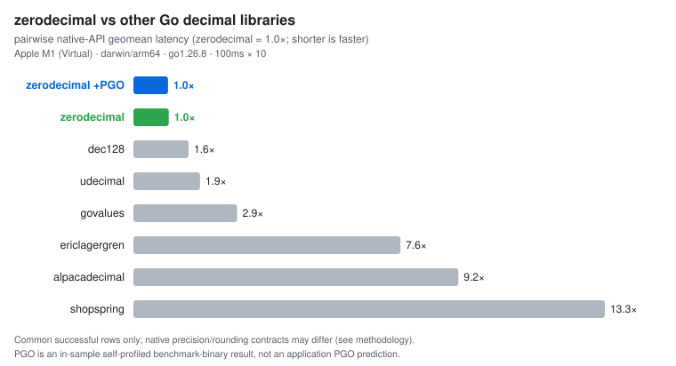

# zerodecimal

Zero-allocation arithmetic and parsing, panic-free fixed-point decimals for
latency-critical Go.

## Why another decimal library

- **Zero-allocation numeric core.** Parsing, arithmetic, comparison,
  rounding, conversions, and every Unmarshal/Scan path perform exactly zero
  heap allocations — success and error paths alike — enforced by
  `testing.AllocsPerRun` gates in the default test suite
  ([alloc_test.go](alloc_test.go)).
- **Lower pairwise geomean latency in the committed suite.** The reproducibly
  configured hosted-runner cache-off comparison reports 36.55% lower sec/op
  than jokruger/dec128, 48.77% lower than quagmt/udecimal, and 92.51% lower than
  shopspring/decimal across each pair's common successful native-API rows
  ([benchmarks/bench-vs-\*.txt](benchmarks/)). These are microbenchmark-suite
  results, not production-throughput guarantees.
- **Independently oracled.** Deterministic boundary suites and 49 fuzz targets
  use shopspring/decimal, `math/big`, and quagmt/udecimal where applicable.
  Arithmetic overflow classification is checked in both directions; codecs
  and SQL boundaries are covered by semantic and round-trip invariants.
- **Panic-free.** Fallible operations return zero-allocation sentinel errors
  ([errors.go](errors.go)) and the fuzz suite requires every target to be
  total — no input, including garbage binary payloads, may panic the library.

## Install

```sh
go get github.com/AlexandrosKyriakakis/zerodecimal
```

```go
import "github.com/AlexandrosKyriakakis/zerodecimal" // package zerodecimal
```

The module's language floor is Go 1.26. Production builds should use Go 1.26.5
or later so they include the standard-library security fixes in that patch.
The library has zero runtime dependencies.

```go
price, err := zerodecimal.NewFromString("99.99")
if err != nil {
	return err
}
qty := zerodecimal.NewFromInt(3)

total, err := price.MulRound(qty, 2, zerodecimal.ToNearestEven)
if err != nil {
	return err
}
fmt.Println(total)                // 299.97
fmt.Println(total.StringFixed(4)) // 299.9700
```

Runnable examples for parsing, arithmetic, rounding, JSON, and SQL live in
[example_test.go](example_test.go). Existing users should read
[MIGRATION.md](MIGRATION.md) before upgrading.

## Design

```go
type Decimal struct {
    coef u128  // |value| · 10^prec, 0 ≤ coef < 2^128
    neg  bool
    prec uint8 // fractional digits, 0..19
}
```

A Decimal is a pointer-free value: 24 bytes on targets with 8-byte maximum
alignment and 20 bytes on gc's 32-bit max-align-4 ports (`386`, `arm`, `mips`,
and `mipsle`). Copy it freely, compare it cheaply, pack it densely. The domain
is |value| < 2^128 / 10^prec — up to 39 significant digits with up to 19
fractional. There is **no `big.Int` anywhere in the package**: every operation
runs on fixed-width 128/256-bit integer math, so nothing can escape to the heap
and magnitude overflow returns `ErrOverflow` instead of degrading into
arbitrary-precision slowness. Legacy `Mul`, `Div`, and `Avg` may truncate
digits beyond `DefaultPrec`; use the exact or directly rounded APIs below when
discarded digits must be explicit. The zero value is canonical zero, ready to
use; no operation produces negative zero.

**Reciprocal division is the headline optimization.** Decimal rescaling,
rounding, formatting, and division all reduce to dividing by powers of ten,
and zerodecimal never asks the hardware divider to do it: 64-bit dividends
use precomputed Granlund–Montgomery–Warren multiply-high magics, and
128/256-bit dividends chain Möller–Granlund 2-by-1 steps off a precomputed
reciprocal table ([div10.go](div10.go), tables generated and re-proven
against `bits.Div64` and `big.Int` in [tables_test.go](tables_test.go)).
A multiply-high plus a shift replaces an 18-cycle `DIV` — and for 128-bit
dividends, two *dependent* `DIV`s. This is a major source of rescaling
headroom; competitor impact is measured by the committed suite rather than
inferred from instruction counts.

`Div` uses **adaptive precision**: the result is the exact quotient truncated
at the largest precision ≤ `DefaultPrec` (19 by default) whose coefficient
still fits 128 bits, so huge quotients degrade precision gracefully and
`ErrOverflow` is reserved for integer quotients that genuinely exceed 2^128.

Because `==` compares representations, an arithmetic result of `1.50` differs
from a parsed `1.5` under `==`; use `Equal` or `Cmp` for numeric comparison.
Parsing trims trailing fractional zeros; arithmetic never does (it would tax
the hot path); formatting trims at output. `Trim` canonicalizes a value on
demand — equal numbers become identical under `==` and as map keys — and
`Rescale` sets an exact representation precision (e.g. `1.50` for a
two-decimal wire format), rounding ties to even when lowering.

The exported `Zero` and `One` variables remain deprecated compatibility
shims. They are mutable Go variables and must not be assigned to; use
`Decimal{}` and `NewFromInt(1)` instead. Package internals do not read them.

## Exact and directly rounded arithmetic

`Mul` and `Div` retain their fast compatibility semantics and can discard
digits without returning `ErrInexact`. For calculations where loss must be
explicit, use:

| Intent | Multiplication/division | Mean |
| --- | --- | --- |
| Require an exact `Decimal` representation | `MulExact`, `DivExact` | `AvgExact` |
| Round once to a requested scale | `MulRound`, `DivRound` | `AvgRound` |

Exact operations return `ErrInexact` when nonzero digits would be discarded,
`ErrUnderflow` for a nonzero result below `10^-MaxPrec`, and `ErrOverflow` for
an excessive magnitude. Direct-round operations preserve the full remainder
through one rounding decision and accept `ToNearestAway`, `ToNearestEven`,
`AwayFromZero`, `TowardZero`, `TowardPositive`, or `TowardNegative`.
`errors.Is(ErrUnderflow, ErrInexact)` is true.

`Sum` and the mean operations use a fixed-width wide signed accumulator, so
cancellation is independent of operand order. `QuoRem` and `Mod` implement
truncated division and correctly return quotient zero when a precision-aligned
divisor is wider than the 128-bit numerator.

## Error model

All sentinels live in [errors.go](errors.go), are returned bare on hot paths,
and match with `errors.Is`. `database/sql` may wrap scanner errors, and
`Scan`'s precomputed `bool` and `time.Time` unsupported-type errors wrap
`ErrScanType`. Constructors and legacy arithmetic operations have panicking
twins for call sites with proven bounds; rows marked `—` below have none.

| Operation | Possible sentinels | Panicking twin |
| --- | --- | --- |
| `New` | `ErrOverflow`, `ErrPrecOutOfRange` | `MustNew` |
| `NewFromString`, `ParseBytes` | `ErrEmptyString`, `ErrMaxStrLen`, `ErrInvalidFormat`, `ErrOverflow`, `ErrPrecOutOfRange` | `RequireFromString` |
| `NewFromStringTrunc`, `ParseBytesTrunc` | `ErrEmptyString`, `ErrMaxStrLen`, `ErrInvalidFormat`, `ErrOverflow` | — |
| `NewFromFloat`, `NewFromFloat32` | `ErrInvalidFloat`, `ErrOverflow`, `ErrPrecOutOfRange` | `RequireFromFloat` |
| `NewFromHiLo` | `ErrPrecOutOfRange` | — |
| `Add`, `Sub`, `Mul` | `ErrOverflow` | `MustAdd`, `MustSub`, `MustMul` |
| `Div` | `ErrDivideByZero`, `ErrOverflow` | `MustDiv` |
| `MulExact`, `DivExact`, `AvgExact` | `ErrInexact`, `ErrUnderflow`, `ErrOverflow`; division also `ErrDivideByZero` | — |
| `MulRound`, `DivRound`, `AvgRound` | `ErrPrecOutOfRange`, `ErrInvalidRoundingMode`, `ErrOverflow`; division also `ErrDivideByZero` | — |
| `QuoRem`, `Mod` | `ErrDivideByZero`, `ErrOverflow` | `MustQuoRem`, `MustMod` |
| `Sum`, `Avg` | `ErrOverflow` | `MustSum`, `MustAvg` |
| `Rescale` | `ErrPrecOutOfRange`, `ErrOverflow` | `MustRescale` |
| `IntPart` | `ErrIntPartOverflow` | — |
| `UnmarshalText`, `UnmarshalJSON` | parse sentinels; JSON `null` into `Decimal` returns `ErrJSONNull` | — |
| `UnmarshalBinary` | `ErrInvalidBinaryData` | — |
| `Decimal.Scan`, `NullDecimal.Scan` | parse sentinels, `ErrInvalidFloat`, `ErrScanType`; required `Decimal` also returns `ErrScanNil` | — |
| `StrictSQLDecimal.Scan`, `StrictNullDecimal.Scan` | parse sentinels, `ErrScanFloat`, `ErrScanType`; required `StrictSQLDecimal` also returns `ErrScanNil` | — |
| Nil decoder/scanner receiver | `ErrNilReceiver` | — |

Everything else is infallible: `NewFromInt`/`NewFromInt32`/`NewFromUint64`,
`Neg`, `Abs`, `Sign`, the `Is*` predicates, `Cmp` and the comparison family,
`Min`/`Max`, the original rounding family, `Trim`, `Prec`, `ToHiLo`, `String`,
`StringFixed`, `AppendFixed`, and `InexactFloat64`. `AppendText`,
`AppendBinary`, the `Marshal*` methods, and `Value` return an error only to
satisfy their interfaces — it is currently always nil.

## Allocation guarantees

[alloc_test.go](alloc_test.go) enforces exact `testing.AllocsPerRun` contracts
on success and error paths:

| Allocations | Operations |
| --- | --- |
| **exactly 0** | Parsing; legacy, exact, direct-round, and aggregate arithmetic; comparison and rounding; `Trim`; decode and Scan paths; `Append*` with sufficient caller capacity |
| **exactly 1** | `StringFixed` for every `uint8` places value; `MarshalText`, `MarshalJSON`, and `MarshalBinary` for their returned slice |
| **normally 1** | Uncached multi-byte `String` results; Go may serve a one-byte string from its static table |
| **exactly 2 in the gated uncached multi-byte case** | `Value`: canonical string plus boxing into `driver.Value` |
| **exactly 0 when the opt-in cache is enabled and hits** | `String` and valid SQL `Value` paths for cache-window values |

The string/`driver.Value` cache is absent by default. Building with
`zerodecimal_strcache` eagerly materializes values in `-1000.00..+1000.00` at
up to two decimal places. Hits avoid result allocation, but the cache adds
startup work, resident memory, heap objects, and GC roots; enable it only when
representative measurements justify it. `zerodecimal_nostrcache` forces the
cache off and wins if both cache tags are present.

## Parsing rules

Grammar: `['+'|'-'] digits ['.' digits] [('e'|'E') ['+'|'-'] digits]`, ASCII
only, at most 200 bytes.

Accepted:

- plain literals: `"123"`, `"-4.20"`, `"+1"`, redundant zeros
  (`"00012.3400"` → `12.34`)
- scientific notation: `"1.23e4"` → `12300`, `"1E-7"` → `0.0000001`
- the maximum coefficient and equivalent noncanonical spellings, including
  `"340282366920938463463374607431768211455.0"` and
  `"3402823669209384634633746074317682114550e-1"`
- redundant fractional zeros beyond 19 places, such as
  `"1.00000000000000000000"`, because canonical precision is checked after
  exponent folding and trailing-zero removal

Rejected:

- `""` → `ErrEmptyString`; input over 200 bytes → `ErrMaxStrLen`
- `"1."` and `".1"` → `ErrInvalidFormat`: both sides of the dot need a digit,
  as do `"."`, `"-"`, `"1..2"`, `"1e"`, and `"1e+"`
- whitespace, underscores, non-ASCII digits, `"NaN"`, and `"Inf"` →
  `ErrInvalidFormat`
- an effective precision above 19 with discarded nonzero digits →
  `ErrPrecOutOfRange`; a canonical coefficient above 2^128−1 → `ErrOverflow`

The `Trunc` variants (`NewFromStringTrunc`, `ParseBytesTrunc`) replace
`ErrPrecOutOfRange` with truncation toward zero at 19 fractional digits. They
still enforce the grammar, input bound, and final coefficient range. Results
are canonical and parsing never allocates, including on failure.

## Rounding modes

`places` counts fractional digits; `places ≥ d.Prec()` returns `d` unchanged.
The whole original family is infallible — the increment can never overflow —
and rounding a negative value to zero yields the canonical unsigned zero.

| Method | Mode | `2.5` → | `3.5` → | `-2.5` → |
| --- | --- | --- | --- | --- |
| `Round(0)` | half away from zero (shopspring `Round`) | `3` | `4` | `-3` |
| `RoundBank(0)` | half to even (banker's) | `2` | `4` | `-2` |
| `RoundUp(0)` | away from zero | `3` | `4` | `-3` |
| `RoundDown(0)` / `Truncate(0)` | toward zero | `2` | `3` | `-2` |
| `RoundCeil(0)` | toward +∞ | `3` | `4` | `-2` |
| `RoundFloor(0)` | toward −∞ | `2` | `3` | `-3` |

`Floor()` and `Ceil()` are `RoundFloor(0)` and `RoundCeil(0)`. Every mode is
pinned tie-by-tie against its shopspring equivalent in
[crosscheck_test.go](crosscheck_test.go) and fuzzed in
[fuzz_test.go](fuzz_test.go).

## JSON and SQL boundaries

`MarshalJSON` emits a quoted canonical decimal. `UnmarshalJSON` accepts bare
JSON numbers and quoted decimal strings; bare input follows JSON number syntax,
while quoted content is semantically unescaped before decimal parsing.
Malformed escapes, invalid UTF-8, and invalid surrogate pairs are rejected.
`Decimal.UnmarshalJSON(null)` returns `ErrJSONNull` and leaves the receiver
unchanged; use `NullDecimal` or `StrictNullDecimal` when null is valid.

For SQL `NUMERIC`/`DECIMAL`, `StrictSQLDecimal` is the recommended required
scanner and `StrictNullDecimal` the nullable scanner. They accept exact text,
byte, and integer sources but reject float32/float64 provenance with
`ErrScanFloat`. The legacy `Decimal` and `NullDecimal` scanners continue to
accept float sources for compatibility. This is a Go-side source-type policy:
a driver that renders a floating column as text cannot be distinguished from
exact decimal text. Exercise `NUMERIC`/`DECIMAL` schemas, casts, and the actual
driver protocol in integration tests. Do not bind a nil
`*StrictSQLDecimal` for a required parameter; `database/sql` converts it to SQL
NULL without invoking `Value`.

## Benchmarks

<picture>
  <source media="(prefers-color-scheme: dark)" srcset="benchmarks/comparison-dark.svg">
  
</picture>

> Collected from clean source commit `0d0b1cfd6f349666f759f22692966c02ea26cdfd`
> on darwin/arm64, Apple M1 (Virtual), Go 1.26.5, cache off, 100 ms × 10
> samples. Libraries ran in a fixed order, so treat this as a transparent
> microbenchmark snapshot rather than production-performance proof.

The comparative suite lives in [benchmarks/](benchmarks/) — a **separate Go
module**, so the competitor dependencies never touch the library's `go.mod`.
Full committed results: [bench-vs-dec128.txt](benchmarks/bench-vs-dec128.txt),
[bench-vs-udecimal.txt](benchmarks/bench-vs-udecimal.txt),
[bench-vs-govalues.txt](benchmarks/bench-vs-govalues.txt),
[bench-vs-shopspring.txt](benchmarks/bench-vs-shopspring.txt),
[bench-vs-alpacadecimal.txt](benchmarks/bench-vs-alpacadecimal.txt),
[bench-vs-ericlagergren.txt](benchmarks/bench-vs-ericlagergren.txt);
the [raw unified samples](benchmarks/bench-all.txt) and
[provenance with input hashes](benchmarks/benchmark-provenance.txt) are also
committed. Methodology and the deliberate semantic asymmetries are documented
in [benchmarks/README.md](benchmarks/README.md). The chart above is regenerated
from those files with `make -C benchmarks chart`; its ratios compare each
competitor only with the rows that both libraries successfully implement.

Against jokruger/dec128 — the nearest pairwise geomean competitor in this run
and also a 128-bit fixed-point design — the artifact reports 83 faster rows,
4 statistical ties, and 1 slower row across 88 common op × shape rows. The
slower row is `AppendText/small_int` at +4.13%:

```
                                │    dec128     │             zerodecimal              │
                                │    sec/op     │    sec/op     vs base                │
Add/typical_price-3                5.668n ±  1%   2.400n ±  3%  -57.64% (p=0.000 n=10)
Mul/typical_price-3                3.788n ±  5%   2.354n ±  1%  -37.86% (p=0.000 n=10)
Div/typical_price-3                9.157n ±  0%   7.070n ±  5%  -22.79% (p=0.000 n=10)
QuoRem/typical_price-3             7.542n ±  5%   3.193n ±  5%  -57.67% (p=0.000 n=10)
Cmp/typical_price-3                4.075n ±  1%   2.105n ±  0%  -48.35% (p=0.000 n=10)
Parse/typical_price-3             11.165n ± 20%   9.715n ±  1%  -12.99% (p=0.000 n=10)
String/typical_price-3             31.04n ± 23%   24.08n ± 13%  -22.42% (p=0.000 n=10)
geomean                            12.68n         8.046n        -36.55%
```

Against quagmt/udecimal, the artifact reports 89 faster rows and 1 statistical
tie across 90 common rows:

```
                                │   udecimal    │             zerodecimal              │
                                │    sec/op     │    sec/op     vs base                │
Add/typical_price-3                5.097n ±  1%   2.400n ±  3%  -52.90% (p=0.000 n=10)
Mul/typical_price-3                6.315n ±  1%   2.354n ±  1%  -62.73% (p=0.000 n=10)
Div/typical_price-3               13.010n ±  1%   7.070n ±  5%  -45.66% (p=0.000 n=10)
QuoRem/typical_price-3            13.535n ±  6%   3.193n ±  5%  -76.41% (p=0.000 n=10)
Cmp/typical_price-3                5.652n ±  0%   2.105n ±  0%  -62.76% (p=0.000 n=10)
Parse/typical_price-3             15.830n ±  0%   9.715n ±  1%  -38.63% (p=0.000 n=10)
String/typical_price-3             37.81n ±  1%   24.08n ± 13%  -36.32% (p=0.000 n=10)
geomean                            15.70n         8.041n        -48.77%
```

Against shopspring/decimal, the artifact reports 84 faster rows and 1
statistical tie across 85 common rows:

```
                                │   shopspring   │             zerodecimal              │
                                │     sec/op     │    sec/op     vs base                │
Add/typical_price-3                47.015n ± 19%   2.400n ±  3%  -94.89% (p=0.000 n=10)
Mul/typical_price-3                46.205n ±  1%   2.354n ±  1%  -94.91% (p=0.000 n=10)
Div/typical_price-3               227.600n ±  1%   7.070n ±  5%  -96.89% (p=0.000 n=10)
QuoRem/typical_price-3            121.200n ±  4%   3.193n ±  5%  -97.37% (p=0.000 n=10)
Cmp/typical_price-3                 4.394n ±  1%   2.105n ±  0%  -52.09% (p=0.000 n=10)
Parse/typical_price-3              85.355n ±  2%   9.715n ±  1%  -88.62% (p=0.000 n=10)
String/typical_price-3             122.25n ±  5%   24.08n ± 13%  -80.30% (p=0.000 n=10)
geomean                             102.7n         7.691n        -92.51%
```

The full reports include B/op and allocs/op for every row. Do not infer a
universal allocation ranking from the latency chart: most numeric-core rows
are zero-allocation, while string-returning and SQL `Value` paths have the
documented cache-off allocation floors below.

### Known trade-offs

Allocation floors accepted by design (from
[benchmarks/README.md](benchmarks/README.md)):

- **`String`: normally 1 allocation** in the default cache-off build for a
  multi-byte result. Go may serve one-byte strings from a runtime static table.
- **`MarshalText`/`MarshalJSON`/`MarshalBinary`: 1 allocation** for the
  caller-owned result slice.
- **`Value`: 2 allocations** in the gated uncached multi-byte case: the
  canonical string plus boxing it into `driver.Value`.
- With `zerodecimal_strcache`, eligible `String` and `Value` hits allocate
  nothing; benchmark cache-on and cache-off as separate populations.

## PGO

PGO attaches to binaries, not libraries — so zerodecimal cannot ship a
profile, but an application build can use one. The hot arithmetic paths avoid
interfaces and indirect calls, and the slow arms (`addUnaligned`, `mulSlow`, the
multi-limb division bodies) are deliberately outlined into small functions
that profile-driven inlining can promote into hot call sites past the default
inlining budget.

1. Collect a CPU profile from production or a representative load:
   `pprof.StartCPUProfile` / `curl .../debug/pprof/profile > default.pgo`.
2. Drop it at your main package root as `default.pgo` (picked up by
   `go build` automatically, i.e. `-pgo=auto`) or pass `-pgo=/path/to/pprof`.
3. Rebuild and benchmark the resulting application.

The committed [benchmarks/bench-pgo.txt](benchmarks/bench-pgo.txt) is a
reproducibly configured hosted-runner experiment, but deliberately in-sample:
the synthetic benchmark binary is rebuilt against its own profile. It reports
a 10.28% lower sec/op
geomean, with 64 faster rows, 24 statistical ties, and 2 slower rows
(`Truncate/small_int` at +6.39% and `UnmarshalBinary/near_max` at +4.86%).
This illustrates compiler opportunity in the harness; it does not predict the
benefit of an application profile:

```
                                │    default    │                 pgo                  │
                                │    sec/op     │    sec/op     vs base                │
Add/typical_price-3                2.331n ±  4%   2.056n ±  7%  -11.82% (p=0.000 n=10)
Sub/typical_price-3                2.816n ±  4%   2.231n ±  2%  -20.81% (p=0.000 n=10)
Mul/large-3                        4.839n ±  3%   3.570n ±  1%  -26.23% (p=0.000 n=10)
Div/typical_price-3                7.724n ±  5%   5.379n ±  3%  -30.36% (p=0.000 n=10)
QuoRem/typical_price-3             3.519n ± 11%   2.867n ±  2%  -18.54% (p=0.000 n=10)
RoundBank/typical_price-3          3.454n ± 20%   2.845n ±  3%  -17.65% (p=0.000 n=10)
Cmp/typical_price-3                2.303n ±  3%   2.135n ±  4%   -7.29% (p=0.000 n=10)
geomean                            8.328n         7.472n        -10.28%
```

On amd64 deployments also consider `GOAMD64=v3`: the BMI2/ADX instructions
materially speed the `bits.Mul64`/`bits.Add64` carry chains that dominate the
primitives (arm64 needs no flag).

## Build tags

| Tag | Effect |
| --- | --- |
| `zerodecimal_prec9` | Sets the compile-time `DefaultPrec` to 9 fractional digits |
| `zerodecimal_prec12` | Sets `DefaultPrec` to 12 fractional digits |
| `zerodecimal_strcache` | Enables the eager small-value string/`driver.Value` cache |
| `zerodecimal_nostrcache` | Forces the cache off |

The precision tags are mutually exclusive. They change the truncation cap for
legacy `Mul`, `Div`, and `Avg`; strict parsing, `MaxPrec`, exact APIs, and
direct-round APIs remain at 19 places. `zerodecimal_nostrcache` wins if both
cache tags are present.

CI runs the full suite across all 12 precision/cache combinations and on
Linux/386. `make test-matrix` also cross-compiles and vets Linux `386` and
`arm`; compiler-shape gates apply only to 64-bit targets where those budgets
were established.

## How correctness is enforced

- **Deterministic cross-check in the default suite**
  ([crosscheck_test.go](crosscheck_test.go)): arithmetic, comparison,
  rounding, parsing, and formatting results are checked against
  shopspring/decimal's unbounded big.Int arithmetic over an exhaustive
  boundary-value pair sweep plus fixed-seed boundary-biased random pairs. The
  overflow oracle is *iff*: every `ErrOverflow` must be proven exact and every
  fitting result must be returned — a spurious error fails as loudly as a
  wrong value.
- **49 differential fuzz targets** (`make fuzz-all`): legacy, exact,
  direct-round, and aggregate arithmetic; parsing and canonicalization; text,
  JSON, binary, and SQL boundaries; nil receivers; cache modes; formatting;
  float conversion; division primitives; and structural invariants.
  shopspring/decimal, math/big, and quagmt/udecimal serve as independent
  oracles where applicable.
- **6.5+ million fixed-seed primitive cases**: the u128/u256 primitives and
  every reciprocal-division path are verified against `bits.Div64` and
  `big.Int` at carry, limb, power-of-ten, and exact-overflow boundaries plus
  millions of shaped random cases per run ([u128_test.go](u128_test.go),
  [u256_test.go](u256_test.go), [div10_test.go](div10_test.go)), and the
  generated magic-constant tables are recomputed from their definitions in
  [tables_test.go](tables_test.go).
- **Allocation, architecture, and codegen gates** assert exact allocation
  counts, 32/64-bit layout assumptions, bounds-check elimination, and the
  64-bit inlining shape of hot paths from the compiler's own `-m=2` report.

## Limitations vs shopspring/decimal

- **Bounded domain.** |value| < 2^128 / 10^prec — at most 39 significant
  digits and 19 fractional digits. There is no arbitrary-precision fallback;
  magnitude overflow returns `ErrOverflow`, while legacy `Mul` and `Div` may
  truncate a result needing more than `DefaultPrec` fractional digits.
- **`places` is `uint8`.** Negative places (rounding at tens/hundreds
  positions, shopspring's `Round(-2)`) are unsupported by design — this is
  what keeps the original rounding family infallible.
- **Legacy division precision is compile-time.** `Div` truncates at adaptive
  precision up to `DefaultPrec` (19, or 9/12 via build tags); there is no
  runtime `DivisionPrecision` knob. `DivRound` selects an explicit output
  scale per call.
- **No `Pow`, `Sqrt`, or transcendental functions yet.**
- **Stricter parsing.** `"1."` and `".1"` are rejected; shopspring accepts
  both.
- **No exotic float forms.** `NewFromFloat` rejects NaN/±Inf with
  `ErrInvalidFloat` rather than panicking, and converts via the shortest
  decimal representation (like shopspring) — floats outside the domain
  error instead of rounding silently.

## Production use

The library's tests and microbenchmarks do not certify an application. For a
money-moving deployment, pin the Go version and build tags; use exact or
direct-round APIs with reviewed scales and rounding modes; test the real SQL
driver/schema and JSON models; compare critical formulas against an
independent implementation; and measure throughput, p99/p999 latency, startup,
RSS, and GC behavior on target hardware before rollout.

## Acknowledgements

Almost all of zerodecimal is original — the zero-allocation `u128`/`u256`
primitives, reciprocal-multiply division by powers of ten, the SWAR parse
path, and the width-dispatched 128/64 division are its own work. The one
ported component is float formatting:

- `dbox.go` (shortest binary-to-decimal digit generation) is ported from the
  Go standard library's Dragonbox implementation in `internal/strconv`,
  BSD-3-Clause. The Dragonbox algorithm is by Junekey Jeon
  (<https://github.com/jk-jeon/dragonbox>). Full notice:
  [THIRD_PARTY_NOTICES.md](THIRD_PARTY_NOTICES.md).

shopspring/decimal and quagmt/udecimal serve as correctness oracles; the
comparative benchmark harness additionally measures against jokruger/dec128,
govalues/decimal, alpacadecimal, and ericlagergren/decimal.

## License

[MIT](LICENSE). zerodecimal incorporates BSD-3-Clause code from the Go
standard library; the required notice is reproduced in
[THIRD_PARTY_NOTICES.md](THIRD_PARTY_NOTICES.md).
